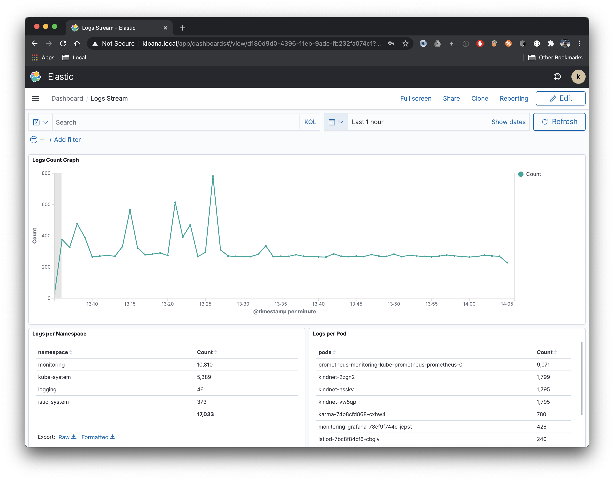
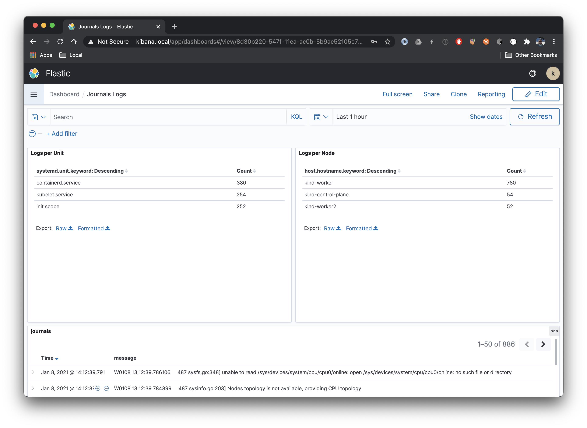
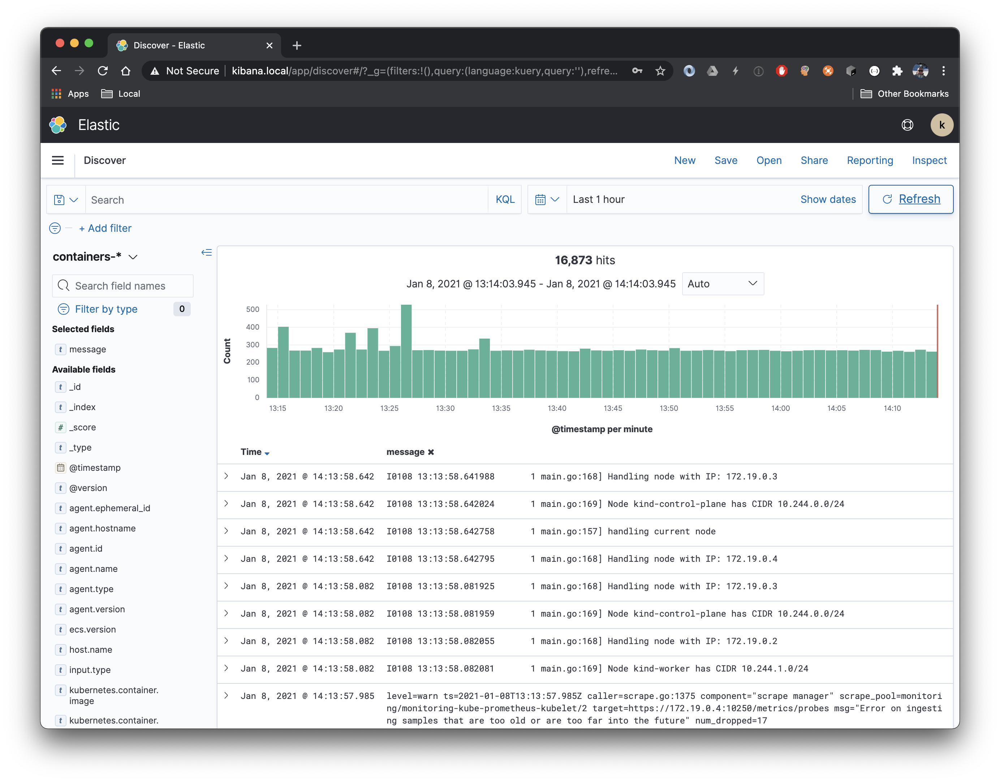

[](https://artifacthub.io/packages/search?repo=kubernetes-logging)
# kubernetes-logging-helm

```
helm repo add logging https://nickytd.github.io/kubernetes-logging-helm
helm repo update
```

This is a comprehensive helm chart for deploying complete Kubernetes logging stack featuring few design options suitable from a minikube/kind setup up to a scaled production grade deployment capable of processing billions of records.


Here is a [setup example](examples) for local development and testing based on [kind](https://kind.sigs.k8s.io) or [minikube](https://minikube.sigs.k8s.io/)

Start a sample provisioning with setting up a local cluster, followed by deployment of the logging stack.
[examples/setup-cluster.sh](examples/setup-cluster.sh)
[examples/install-elk.sh](examples/install-elk.sh)
```ìnstall-elk.sh -minikube``` or ```ìnstall-elk.sh -kind```

Provisioning options:
By default the helm chart setup following components:
 1. Elastic coordination node
 1. Elastic master node
 1. Elastic data node
 1. Filebeat 
 1. Logstash
 1. Kibana
and optionally  
 1. Journalbeat
 1. MetricBeat
 1. Kafka and Zookeeper
 
The logging stream has dedicated Elasticsearch indices. The stdout and stderr from containers are pushed to "containers-<date>" indices and the systemlog of the hosts, if journabeat is enabled. is pushed to "journals-<date>". When enabled metrics are delivered to "containers-<date>" indices.

The chart also supports external(outside the cluster) Elasticsearch instance. In this configuration no elastic (coordination, data, master) nodes will be provisioned by the helm chart.

Kibana by default comes with 2 predefined dashboards and set of searches
1. Containers logs dashboard, grouping container logs per namespace and pod

2. Journals logs dashboard, grouping systemlogs per system unit and node


Usually logs are searched and inspected via the Discovery view
1. Containers Logs in Discovery View

1. Containers Logs enhanced with Kubernetes metadata. 


In Kibana multi tenant layout is also supported. The Helm chart sets up a Developer tenant with the corresponding role having read/write permission in the tenant space.
