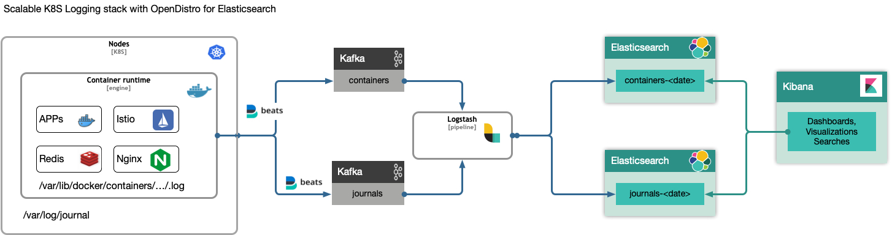

[](https://artifacthub.io/packages/search?repo=kubernetes-logging)

# kubernetes-logging-helm with [Opensearch](https://opensearch.org)

This helm chart deploys a scalable containerized logging stack, enabling log observability for kubernetes applications with Opensearch. The deployment may take various forms, from a single node setup usable for a local development up to scaled multi nodes opensearch deployments used in production environments. It is an easy way to provision a managed Opensearch cluster with optional kafka brokers, flunetbits and fluentd(s) supplying additional initialization steps for the varois components.




## Adding the helm chart repository:
```
helm repo add logging https://nickytd.github.io/kubernetes-logging-helm
helm repo update
```

```bash
helm install ofd logging/kubernetes-logging
```

Pages: https://nickytd.github.io/kubernetes-logging-helm

Uprgade Notes 2.x to 3.0.0:
Since version 3.0.0, the chart values are renamed and follow camel case recommendation.
