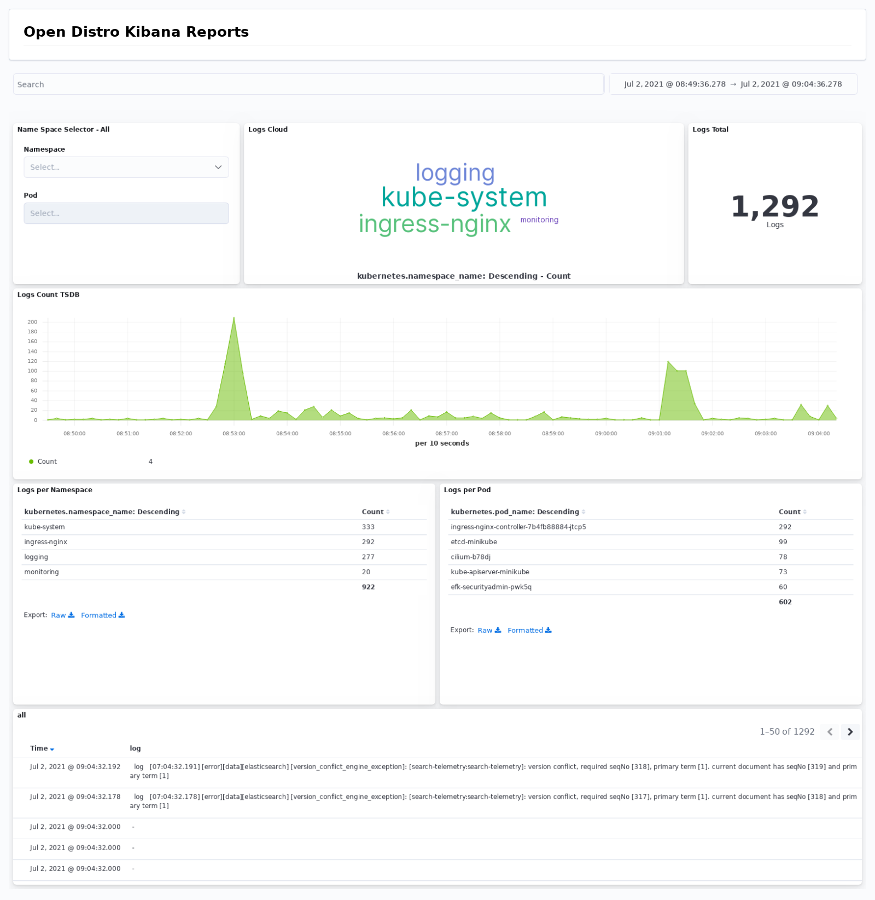
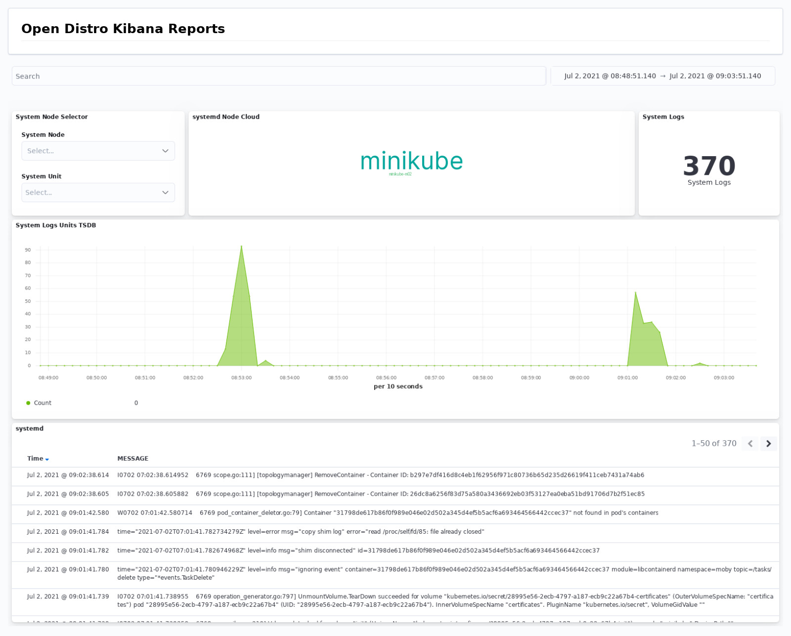

# kubernetes-logging-helm

This helm chart deploys a scalable containerized logging stack with the main purpose of enabling log observability for kubernetes applications. The design supports both local development use cases such as minikube deployments up to a scaled production scenarios. The latter scenarios leverage kafka message broker, completely decoupling in this way,  the log generation and log indexing functions. 

The helm chart supports elasticsearch in various configurations starting from a single node setup usable for local development, to a scaled multi nodes elasticsearch deployment battle proven in production scenarios. In the latter case there are 3 types of nodes (coordination, data and master) where each of those can be both horizontally and vertically scaled depending on the load and shards replication demands. 

Finally this helm chart provides index templates management in elasticsearch and index pattern management in kibana. An initial predefined set of dashboards is also provided for illustration purposes.

Here is a [setup example](https://github.com/nickytd/kubernetes-logging-helm/tree/master/examples) for local development and testing based on [minikube](https://minikube.sigs.k8s.io)

[Single node setup example](https://github.com/nickytd/kubernetes-logging-helm/tree/master/examples/k8s-logging-minikube-values.yaml)

Provisioned components:
 1. Single Elasticsearch type node
 1. Fluent-Bit instance per kubernetes node
 1. (optional elastic-exporter)

[Scaled multi node setup example](https://github.com/nickytd/kubernetes-logging-helm/tree/master/examples/k8s-logging-scaled-minikube-values.yaml). Thus example requires a kubernetes cluster with at least two nodes, demonstrating pod anti affinity configuration for the statefulsets and pod schedule spread configurations for the deployments

Provisioned components:
 1. 2 Elastic coordination nodes
 1. 2 Elastic master nodes
 1. 2 Elastic data nodes
 1. Fluent-Bit instance per kubernetes node
 1. 2 Kafka brokers
 1. 2 Zookeeper instance
 1. 2 FluentD instances
 1. (optional elastic-exporter)

Following dashboards in Kibana are also provisioned for illustration purposes

Logs Stream Dashboard 

Systemd logs Dashboard

Nginx Access Logs Dashboard

Multi tenant layout is also supported in Kibana. This helm chart sets up a Developer tenant with the corresponding role having read/write permission in the corresponding tenant space.
