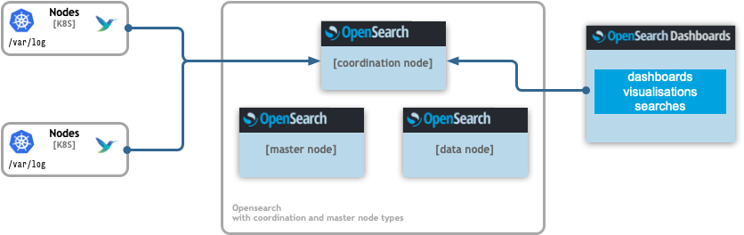
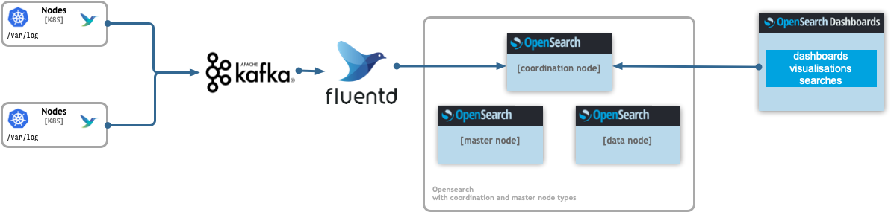

The kubernetes logging helm chart supports a number of deployment layouts of opensearch and other components depending on the concrete purpose and size of the cluster.

## Sinlge Node development cluster


opensearch:
  single_node: true

fluentbit:
  containersLogsHostPath: /var/log/pods
  journalsLogsHostPath: /var/log
  containersRuntime: docker

kafka:
  false:



This layout is the simplest possible requiring the least compute and memory resources. It comprises of the log shippers, a single opensearch node and a single opensearch dashabord UI. The log shippers are fluentbits deployed on each kubernetes node mounting the host filesystem. Because the locations of the containers logs or the host journals can vary, those locations have to be adapted accordingly in the fluentbit configuration. The logs are directly send to the Opensearch node for indexing without the need of a message broker in between.

## Multi Node development cluster

Opensearch supports dedicated [node types](https://opensearch.org/docs/latest/opensearch/cluster/) based on specific functions in the cluster. A coordination node, data node and master node forming an opensearch cluster can be deployed when single_node option is disabled.


opensearch:
  single_node: false


## Multi Node cluster for Production

When the setup is deployed in a production environment both aspects for reliably and throughout of the logs streams are addressed by the helm chart with the introduction of a message broker. A running message broker effectively accumulates spikes of logs volumes or downtimes of the backend opensearch cluster.

Even more importantly each component can be scaled horizontally insuring better reliability.


opensearch:
  single_node: false

data:
  replicas: 3

master:
  replicas: 3

client:
  replicas: 3

kafka:
  enabled: true
  replicas: 3

zookeeper:
  replicas: 3

fluentd:
  replicas: 3

#and so on


Additionally each type of workload scheduling strategy can be further optimized by defining node and pods (anti)affinity rules.

For example for stateful sets like kafkas or data nodes following affinity strategy guarantees that pods will be scheduled on different kubernetes nodes.

affinity:
  podAntiAffinity:
    preferredDuringSchedulingIgnoredDuringExecution:
    - weight: 100
      podAffinityTerm:
        labelSelector:
          matchExpressions:
          - key: type
            operator: In
            values:
            # with the corresponding label
            - kafka
        topologyKey: kubernetes.io/hostname


Or in the case of a deployments like the opensearch coordination nodes or fluentds a spread of pods over nodes can be achieved with:

topologySpreadConstraints:
  - maxSkew: 1
    topologyKey: kubernetes.io/hostname
    whenUnsatisfiable: ScheduleAnyway
    labelSelector:
      matchLabels:
        # with the corresponding label
        type: client
