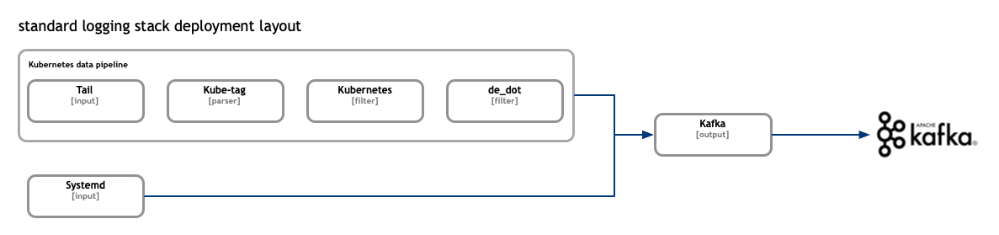
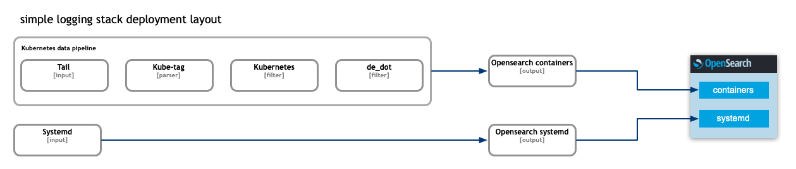
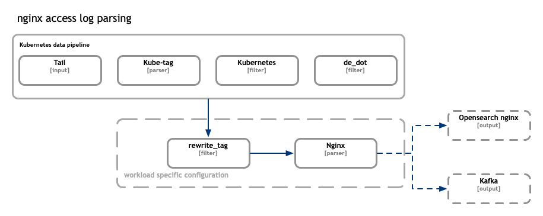

[FluentBit](https://fluentbit.io/) is installed as daemon set on each of the k8s nodes by the helm chart. It follows FluentBit [data pipeline](https://docs.fluentbit.io/manual/concepts/data-pipeline) setup designed for kubernetes environments.

The helm chart itself supports different deployment layouts depending on whether a simple or standard model is required. The standard model is recommended in production where various components runs in HA mode. In this case the FluentBit instances send the collected logs to kafka brokers. The kafka brokers are used for buffering and greatly increase the overall reliability and stability of the entire stack.



In the simple case the FluentBit instances communicate directly with OpenSearch nodes.


In both cases there is a set of FluentBit configurations which is responsible for proper logs collection from the containers and enriching those with the respective kubernetes metadata such as namespace of the origin workload, its labels and so on. The metadata is later used in indexing, searchers and visualisations scenarios. This shared configuration is shown on the diagrams here as "kubernetes data pipeline".

The "kubernetes data pipeline" uses standard "Tail" input plugin to read the logs from the mounted node filesystem, "Kube-Tag" parser plugin to generate FluentBit tag of the events.
Followed by "Kubernetes" filter used to add the kubernetes metadata to the events followed by the end by a "de_dot" filter used to replace dots "." with undescores "_" in event names.

The "kubernetes data pipeline" is the foundation of any application specific configurations. For example nginx ingress controller produces unstructured access logs. To parse those logs and transform the lines into structured json formatted messages we shall enrich the pipeline with corresponding filters and parsers.



The nginx access logs parsing example is located at [fluentbit-configs](https://github.com/nickytd/kubernetes-logging-helm/tree/main/chart/fluent-bit-configs) folder. Any additional application specific configs needs to be saved in the same location following filenames the naming conventions. Aka filters needs to have "filter" predix, "parsers" for parsers and so on.

In the nginx access log example the rewrite_tag filter is used to tag messages originating from containers and which share the `app_kubernetes_io/name: ingress-nginx` label.
```
[FILTER]
    Name          rewrite_tag
    Match         kube.*
    Rule          $kubernetes['labels']['app_kubernetes_io/name'] "^(ingress-nginx)$" nginx false
[FILTER]
    Name          parser
    Match         nginx
    Key_Name      log
    Parser        k8s-nginx-ingress
    Reserve_Data  True
```
The messages are tagged and re-emitted in the FluentBit data pipeline. Later matched by the nginx parser which uses regex to construct a json formatted structured message
```
[PARSER]
    Name         k8s-nginx-ingress
    Format       regex
    Regex        ^(?<host>[^ ]*) - (?<user>[^ ]*) \[(?<time>[^\]]*)\] "(?<method>\S+)(?: +(?<path>[^\"]*?)(?: +\S*)?)?" (?<code>[^ ]*) (?<size>[^ ]*) "(?<referrer>[^\"]*)" "(?<agent>[^\"]*)" (?<request_length>[^ ]*) (?<request_time>[^ ]*) \[(?<proxy_upstream_name>[^ ]*)\] (\[(?<proxy_alternative_upstream_name>[^ ]*)\] )?(?<upstream_addr>[^ ]*) (?<upstream_response_length>[^ ]*) (?<upstream_response_time>[^ ]*) (?<upstream_status>[^ ]*) (?<reg_id>[^ ]*).*$
    Time_Key     time
    Time_Format  %d/%b/%Y:%H:%M:%S %z
```


Additional parsers are supported such as multiline parses allowing to reconstruct java stacktraces into a single message.
Here is an example of such configuration.<br><br>
`filter-zookeeper.conf`:
```
    [FILTER]
        Name                  rewrite_tag
        Match                 kube.*.logging.*.*
        Rule                  $kubernetes['labels']['type'] "^(zk)$" zookeeper false
        Emitter_Storage.type  filesystem
    [FILTER]
        Name                  multiline
        Match                 zookeeper
        multiline.parser      zookeeper_multiline
 ```

`parser-zookeeper.conf`
 ```
    [MULTILINE_PARSER]
        name            zookeeper_multiline
        type            regex
        flush_timeout   1000
        key_content     log
        # Regex rules for multiline parsing
        # ---------------------------------
        #  - first state always has the name: start_state
        #  - every field in the rule must be inside double quotes
        #
        # rules |  state name  | regex pattern                        | next state name
        # ------|--------------|--------------------------------------|----------------
        rule     "start_state"  "/^(?<exception>[^ ]+:)(?<rest>.*)$/"  "cont"
        rule     "cont"         "/\s+at\s.*/"                          "cont"
```

> **Hint:** For high volume logs producers consider adding: `Emmiter_Storage.type filesystem` property. It allows additional buffering during re-emitting of the events, details see [FluentBit rewrite-tag](https://docs.fluentbit.io/manual/pipeline/filters/rewrite-tag).
