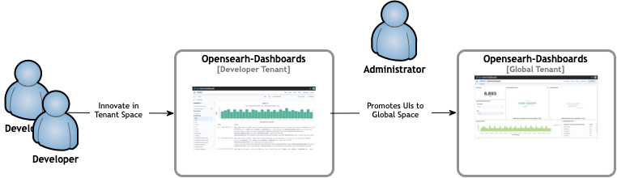

Kubernetes logging helm chart deploys an single instance of [OpenSearch Dashboards](https://opensearch.org/docs/latest/dashboards/quickstart-dashboards/) (or just Dashboards) presenting the UI interface to OpenSearch indices.

The helm chart enables authentication configurations based on SAML, ODIC or standalone and leverages dashboards tenant concept.
The latter allows teams to innovate UIs such as searches, visualizations and dashboards in shared tenant space leaving a predefined readonly UIs at a global space. Once the UIs are ready to be promoted those can become part of the helm chart [saved-objects](https://github.com/nickytd/kubernetes-logging-helm/tree/main/chart/saved-objects) folder and become standard set of the chart deployment.

In addition the helm chart provisions an OpenSearch [DataPrepper](https://opensearch.org/docs/latest/data-prepper/index/) component which allows OpenTelemetry traces to be indexed and later visualized at Dashboards observability UI.
